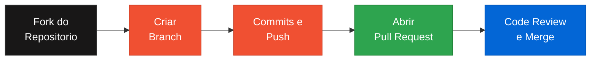

# Explorando Colaboracao e Markdown

**[PT-BR](#sobre-o-projeto) | [English](#about-the-project)**

---

## Sobre o Projeto

> Projeto desenvolvido durante o bootcamp da [DIO (Digital Innovation One)](https://www.dio.me/)

Repositorio de estudo pratico sobre **colaboracao no GitHub** e **sintaxe Markdown**. O objetivo e documentar as melhores praticas de trabalho colaborativo usando Git e GitHub, incluindo criacao de issues, pull requests, e formatacao de documentacao tecnica com Markdown.

---

## Fluxo de Colaboracao no GitHub

---

## Conteudo do Repositorio

| Arquivo | Descricao |
|---|---|
| `tutorial.md` | Tutorial de Markdown e Git |
| `issues.md` | Exemplos de criacao de issues |
| `pull_request_example.md` | Exemplos de pull requests |
| `LICENSE` | Licenca MIT |

## Competencias Demonstradas

- Sintaxe Markdown (titulos, listas, tabelas, links, imagens, codigo)
- Fluxo de trabalho Git (branches, commits, merges)
- Colaboracao no GitHub (issues, pull requests, code review)
- Documentacao tecnica profissional

## Aplicacao na Industria

Markdown e Git sao ferramentas essenciais para qualquer equipe de desenvolvimento. Documentacao bem estruturada reduz onboarding de novos membros e melhora a manutencao de projetos.

---

## English

### About the Project

> Project developed during the [DIO](https://www.dio.me/) bootcamp

A hands-on study repository about **GitHub collaboration** and **Markdown syntax**. It covers best practices for collaborative work using Git and GitHub, including issues, pull requests, and technical documentation formatting.

### Skills Demonstrated

- Markdown syntax (headings, lists, tables, links, images, code blocks)
- Git workflow (branches, commits, merges)
- GitHub collaboration (issues, pull requests, code review)
- Professional technical documentation

---

## Licenca | License

Este projeto esta licenciado sob a [Licenca MIT](LICENSE). | This project is licensed under the [MIT License](LICENSE).

---

Developed by [Gabriel Demetrios Lafis](https://github.com/galafis)
